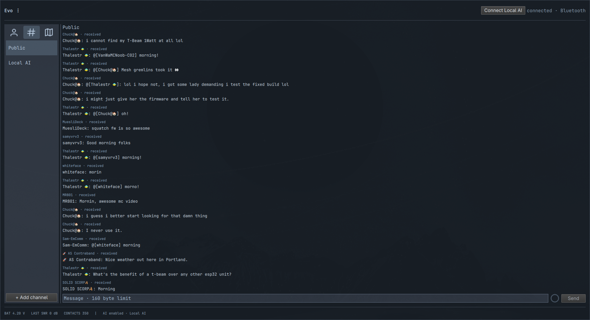

# Meshcore Atlas

**MeshCore messaging, online node maps, and private-channel local AI—from your Omarchy desktop.**

Connect a MeshCore companion node over Bluetooth or USB, manage conversations, and optionally make a local language model available to your own private mesh channel.

[Download 0.3.0](https://github.com/ivan-theaitradeoff/meshcore-atlas/releases/tag/v0.3.0) · [Report an issue](https://github.com/ivan-theaitradeoff/meshcore-atlas/issues) · [Privacy and permissions](docs/PRIVACY.md)

> **Early release.** Bluetooth messaging and local AI have been exercised with hardware. USB is implemented but has not been hardware-tested. This is an independent project, not an official MeshCore client or a security-certified product.



*Screenshot from an earlier interface version. Visible node names and messages are included with the repository owner’s approval; image metadata has been removed.*

## What you can do

- **Message over the mesh:** public, private, and hashtag channels; direct messages to saved contacts; local history and message actions.
- **Manage your node:** guided connection setup, automatic reconnect, node details, and radio settings.
- **Arrange your workspace:** toggle messages and the map independently, use them side by side, and resize the divider. Colors follow your Omarchy theme.
- **Find nodes on a map:** online OpenStreetMap tiles, search, repeater filtering, and clustered markers.
- **Use local AI remotely:** allow selected private channels to send questions to a model running on your computer.
- **Control your model:** LM Studio model selection and context settings from the app or mesh messages.
- **Keep conversations going:** optional local conversation memory and numbered multipart replies.

## Before you install

You need Omarchy with the Quattro Quickshell plugin API, Python 3.11 or newer, and a radio running **MeshCore companion firmware**. Bluetooth needs a working BlueZ adapter. USB needs a data cable and permission to access the serial device.

First-run setup installs the bridge in its own Python environment. It can request desktop authorization to install missing map, QR-code, and notification packages. Internet access is needed for these downloads. See [exact installation scope](docs/PRIVACY.md#installation-and-permissions).

## Install

Run this once in a terminal:

```sh
omarchy plugin add https://github.com/ivan-theaitradeoff/meshcore-atlas --enable
```

Then click the Meshcore Atlas icon in your bar. Continue in the app:

1. Set up your node with the MeshCore phone app first. Disconnect it in that app, then forget/unpair it in your phone's Bluetooth settings.
2. Keep the node powered on near the computer. Close any other app using it.
3. Follow **Connect a node** to install components, find your node, and choose Bluetooth or USB.
4. For Bluetooth pairing, enter the current PIN displayed on the node. Choose whether to allow radio sending, then connect.
5. Start messaging. Channels already saved on the node will appear. If Public needs setup, follow its in-app prompt to import the channel key from the MeshCore phone app.

Setup opens on first use. You can reopen it from **node name → ⋮ → Connection setup**. The app remembers your connection and last conversation.

## Connect local AI

Local AI is optional and disabled by default. No models are included or downloaded by this plugin.

1. Run a local model server on the computer connected to the desktop node. LM Studio supports the full model-management workflow. Ollama and compatible servers support replies, but not all model-management commands.
2. Click **Connect Local AI** and follow the guide. Set the loopback server address in **Local AI Settings**; LM Studio commonly uses `http://127.0.0.1:1234` and Ollama `http://127.0.0.1:11434`.
3. Create a private channel and add the same channel name and key to the MeshCore app on your separate personal node/phone. A repeater can extend coverage where needed; it is not required for nodes within direct range.
4. Select the private channel in **Allowed private AI channels**, enable replies, and save preferences. Radio sending must also be enabled.
5. Select a model. Send `/commands` from your personal node to check the connection.

| Message | What it does |
| --- | --- |
| `/commands` | Show available commands |
| `@ai models` | List models in LM Studio |
| `@ai use N` | Select/load a numbered model |
| `@ai status` | Show the model, active context when available, and busy/ready state |
| `@ai context 128k` | Request 131,072-token context, if the model and available memory support it |
| `@ai reset` | Clear your conversation memory |

After successful model selection, send ordinary messages to chat. Long replies are split into numbered radio messages, ten seconds apart. Longer questions can be sent as `1/2 first part`, then `2/2 second part`; incomplete questions expire after five minutes. There is no automatic retransmission.

**Remember conversations** is enabled by default. It uses bounded recent exchanges, not the entire context window. Memory is separated by channel and sender display name; display names are not authenticated identities. Turning memory off stops using it but does not erase stored records. Anyone holding an allowed private channel's key can invoke AI and its model commands.

### Default AI settings

| Setting | Default |
| --- | --- |
| AI replies / allowed channels | Disabled / none |
| Maximum question / answer | 1,600 characters each |
| Generation limit | 1,024 tokens |
| Channel / global cooldown | 0 seconds / 0 seconds |
| Response timeout | 120 seconds |
| Conversation memory | Enabled |

## Privacy and limitations

Desktop notifications show only a generic new-message alert. Use the notification’s Open app action to open or focus the window. Message text and sender/channel names stay out of notification content and process arguments.

- The source-only release ZIP excludes personal conversations, node settings, private keys, screenshots, and models. The repository retains the explicitly approved preview shown above. Runtime data stays separate from the plugin code.
- Local history and AI memory are stored in plaintext with restricted file creation permissions. Private channel messages are available to other holders of the channel key.
- Opening the online map contacts OpenStreetMap. The tile service sees your IP address and requested map area. Offline maps are not implemented.
- “Heard repeats” counts received copies, not confirmed delivery or unique repeaters.
- Senders heard only in channel messages are not verified direct-message contacts. Clicking a **heard** entry opens its channel.
- Only the most recent 100 messages per conversation are displayed. Older records remain subject to retention settings.
- Channel removal/creation through the app separates the old slot's local history. Channel replacements made outside the app are not guaranteed to be distinguished from the previous channel; review local history before reusing a slot.
- Multi-field node changes are not atomic. If a save fails, reopen settings to inspect the result.

Read [Privacy and permissions](docs/PRIVACY.md) before enabling AI or sharing channel keys.

## Troubleshooting

| Problem | Next step |
| --- | --- |
| Node not found | Disconnect the phone/other apps, restart the node, and search again. |
| Paired but cannot connect | Enter the current PIN and use **Repair pairing** in Connection setup. |
| Bridge offline | Open Connection setup → **Troubleshooting** or **Update / repair components**. |
| AI does not reply | Check the local server, selected model, allowed channel, saved reply preferences, and radio sending permission. |
| Reply arrives in pieces | Wait for the numbered parts; they are spaced ten seconds apart. Radio delivery is not guaranteed. |

When reporting a problem, include the app version, operating-system version, transport, and error text. **Remove message contents, device addresses, channel keys, PINs, personal names, and location details from screenshots and logs.**

## Update and uninstall

Update the plugin, then open **Connection setup → Update / repair components** and reconnect:

```sh
omarchy plugin update meshcore.atlas
```

To uninstall, close the app and run these before removing its folder:

```sh
bash ~/.config/omarchy/plugins/meshcore.atlas/scripts/remove-bridge.sh
omarchy plugin remove meshcore.atlas
```

Uninstall stops the bridge and removes its Python environment. Settings and history are retained so they can be recovered. See [stored data](docs/PRIVACY.md#stored-data) if you want to erase them separately. System packages and AI models are not removed.

## License and acknowledgments

[MIT](LICENSE). Python, Qt, and radio dependencies retain their own licenses. Map data © [OpenStreetMap contributors](https://www.openstreetmap.org/copyright); map use follows the [tile usage policy](https://operations.osmfoundation.org/policies/tiles/).
